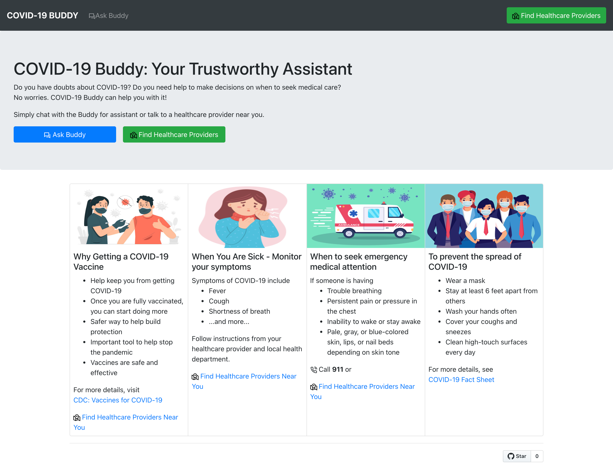
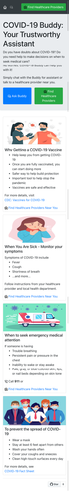
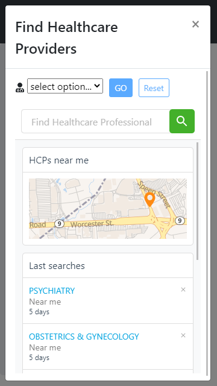
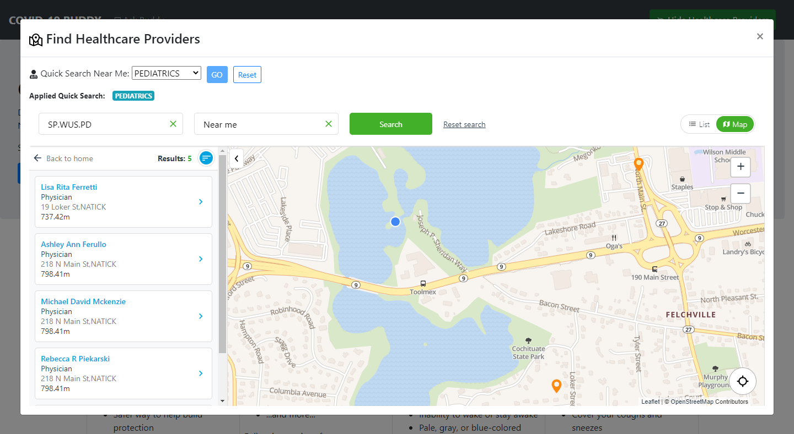
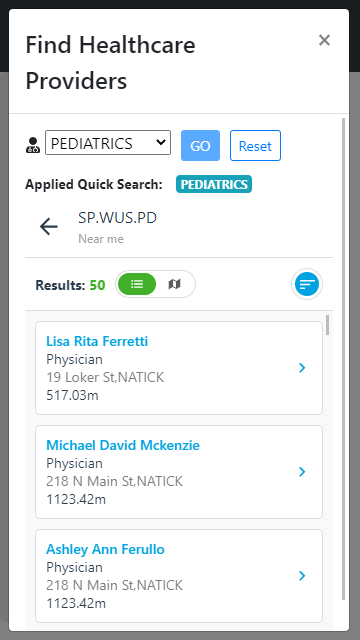
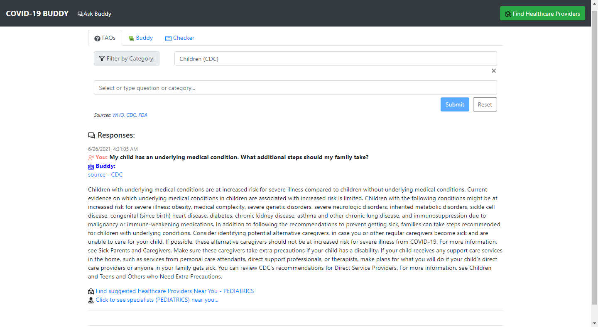
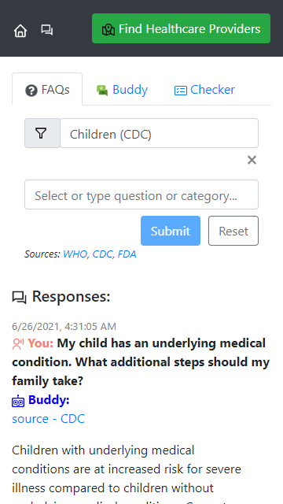
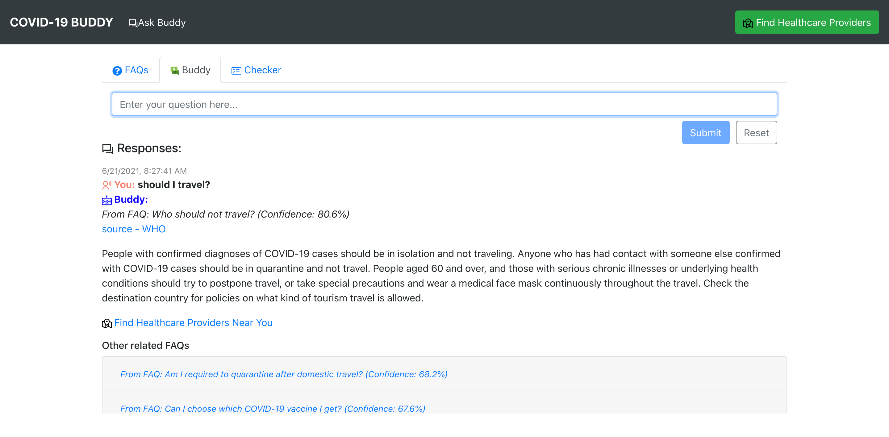

# COVID-19 Buddy App
 
Visit 
* website: https://covid-buddy.herokuapp.com/
* YouTube: https://youtu.be/2QuPYa8hZWE

The COVID-19 pandemic has been greatly impacting every life on earth, especially underserved communities who were significantly impacted by COVID-19 due to a lack of access to medical facilities and misleading and disinformation about COVID-19 and the vaccines. 

The goal of this **COVID-19 Buddy** app is to assist a user by providing accurate information about COVID-19 from trustworthy sources and organizations as well as leveraging AI to suggest nearby Healthcare providers (HCPs) for user based on his/her input to enable greater access to healthcare providers for all.

This project was developed to for the DEVPOST Hackathon - Code for COVID Relief ([Hackathon link](https://healthcareappchallenge.devpost.com/)) and received the [Honorable Mentions prize](https://twitter.com/IQVIA_developer/status/1418314937420615684?s=20) :)
* [Project](https://devpost.com/software/covid-buddy-sqno5c).
* To learn more about this project, see [devpost_project.md](./devpost_project.md)

| Features      | Desktop App   | Mobile App    |
| ------------- | :---------:   | :----------:  |
| Landing Page  |  |   |
| Find Healthcare Providers (HCPs)  |  |   |
| Find HCPs - Quick Search (Map)  |  |   |
| Find HCPs - Quick Search (List)  |  |   |
| FAQs  |  |  |
| FAQs - Expanded Suggested Specialists  |  |  |
| FAQs - Specialist Info  |  |  | |
| Buddy  |  |   |
| Checker  |  |   |

## Installation

#### Installing the App - JavaScript + NodeJS

The COVID-19 Buddy App is a fullstack app which consists of
* Server (NodeJS, Express)
* Client (React)

To install the Server, invoke the following command at the root of this project

```
$ cd <covid-buddy>
$ yarn install
```

To install the Client, invoke the following command in the `client` folder

```
$ cd <covid-buddy>/client
$ yarn install
```

#### FAQs Data Collection - Python

Note that this step is not required if you are not planning to collect new FAQs data.

Below are python libraries that are used to run Jupyter Notebooks in `./data` to collect FAQs data using Python versions 3.6.8:

* requests==2.21.0
* beautifulsoup4==4.7.1


## Instructions:

**IMPORTANT**: Before running the app, you will need to update `./client/src/services/HCLSDKService.js` to use a valid HealthcareLocator's `apiKey` in order to enable the **Find Healthcare Providers** feature.

To obtain a HealthcareLocator's apiKey, you can create your free HCL SDK account [here](https://www.healthcarelocator.com/en/pricing)

#### Start App in Production mode - NodeJS

Use the following command to start a server to run this app in a production mode (using the build app)

```
$ yarn run start-server-app
```
**IMPORTANT** Internet connection is required when starting a server to import `'@tensorflow-models/universal-sentence-encoder'` during the initialization of the serer


Once the server is successfully started, navigate to http://localhost:8080

#### Start App in Client's Debug mode - NodeJS

To start the app during the Client development, the App's server and the client's server must be started individually. 

##### To start the App's server

use the following command at the root level of this project

```
$ yarn run start
```
Note again that an internet connection is required in order to import `'@tensorflow-models/universal-sentence-encoder'` during the initialization of the serer

##### To start the App's server

cd to the `./client` folder use the following command to start the client app

```
$ yarn start
```

The client report will be automatically launched at `http://localhost:3000`

## Learning basic of Software Testing through the COVID-19 Buddy app

If you are interested in an introduction of unit testing using tests authored for the COVID-19 Buddy app as an exmple,
* see  [artifacts/intro_automatedtesting.pdf](./artifacts/intro_automatedtesting.pdf)


## Licensing, Authors, Acknowledgements<a name="licensing"></a>

* The [HealthCareLocatorSDK](https://www.healthcarelocator.com/en/developers) is used to deliver the "Find Healthcare Providers" features. All credits must go to them.
* Images used in the Landing page were downloaded from https://www.freepik.com/free-vector. All credits must go to them.
* The CDC HealthBot embedded in the Checker tab was taken from the CDC website https://tools.cdc.gov/medialibrary/index.aspx#/media/id/405848. All credits must go to them.

Lastly, this project is [MIT licensed](./LICENSE).