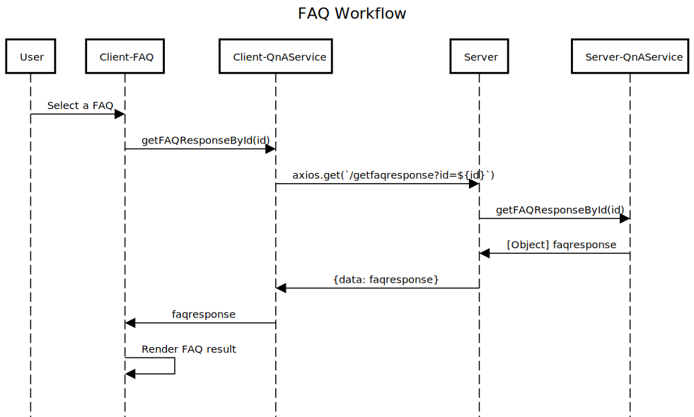

## Sequence diagram

### FAQ Workflow
 

The sequence diagram above was created from  https://sequencediagram.org/ using the syntaxes below:

```
title FAQ Workflow

User->Client-FAQ:Select a FAQ
Client-FAQ->Client-QnAService:getFAQResponseById(id)
Client-QnAService->Server: axios.get(`/getfaqresponse?id=${id}`)
Server->Server-QnAService: getFAQResponseById(id)
Server-QnAService->Server: [Object] faqresponse
Server->Client-QnAService: {data: faqresponse}

Client-QnAService->Client-FAQ: faqresponse
Client-FAQ->Client-FAQ: Render FAQ result

```